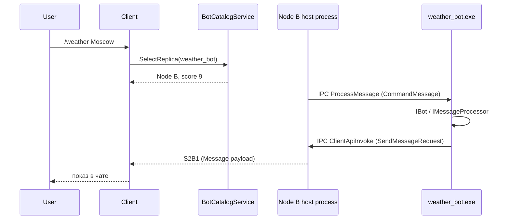
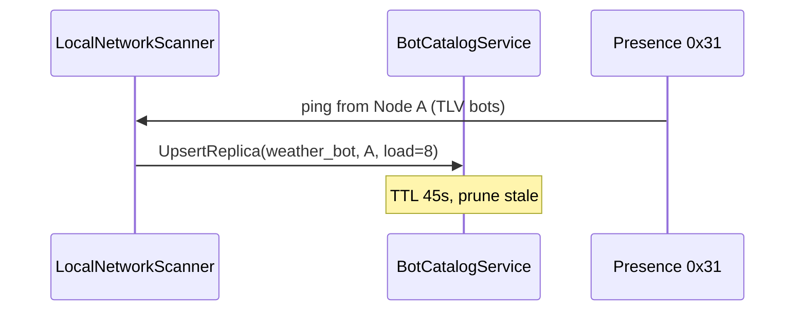
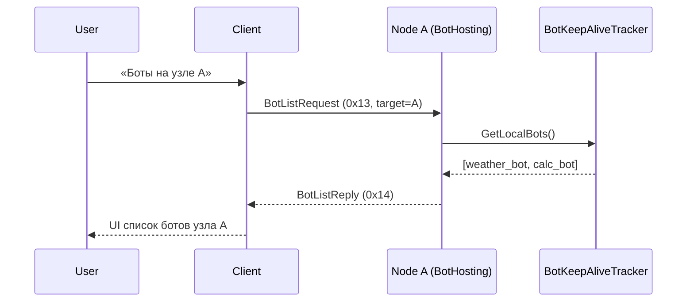

# ShortP2P — план разработки подсистемы Bot Hosting

Документ описывает поэтапную разработку **хостинга ботов на узлах сети ShortP2P**: протокол, архитектуру, балансировку нагрузки и размещение одного бота на нескольких узлах для повышения доступности.

**Статус:** проектирование (реализация отсутствует).  
**Связанные артефакты:** `protocol.md`, `src/ShortP2P.Discovery/README.md`, `PresencePeerCapabilities.BotHosting`, [Botticelli.Interfaces/IBot.cs](https://github.com/devgopher/botticelli/blob/develop/Botticelli.Interfaces/IBot.cs).

---

## 1. Цели и границы

### 1.1. Цели

| Цель | Описание |
|------|----------|
| **Хостинг на узле** | Любой узел с флагом `BotHosting` может запускать один или несколько **отдельных исполняемых файлов** ботов локально |
| **Процессная модель** | Бот — **отдельный `.exe` / бинарник**; основной процесс P2P (WinForms / MAUI Android / MAUI Windows) — **хостер**, который управляет жизненным циклом и IPC |
| **KeepAlive** | Каждые **10 с** бот шлёт хостеру пакет **KeepAlive** с `botId`, **версией**, **CRC** и меткой времени формирования сигнала |
| **Подлинность бота** | У каждого бота — **версия** (semver) и **CRC-32** бинарника; хост и клиенты сверяют их для установления подлинности |
| **Единый интерфейс команд** | Клиент отправляет строку вида `/commandName arg1 arg2 … argN`; бот возвращает структурированный ответ |
| **Типы ответов (v1)** | Только **текст** и **графика** (изображение); **только новые сообщения** (`SendMessageAsync`); файлы, аудио, интерактив — позже |
| **Сообщения (v1)** | **Нельзя** редактировать и **нельзя** удалять сообщения в чате с ботом — ни со стороны бота, ни со стороны пользователя |
| **Высокая доступность** | Один логический бот (`weather_bot`) может быть зарегистрирован на нескольких узлах; клиент выбирает наиболее свободный |
| **Прозрачность для пользователя** | В чате бот выглядит как контакт; команды — сообщения с префиксом `/` |
| **Список ботов узла** | Каждый узел с `BotHosting` **обязан** отдавать актуальный список ботов, которые он хостит (локальный API + ответ на сетевой запрос) |

### 1.2. Вне scope v1

- Маркетплейс / установка сторонних ботов из сети (только локальная регистрация и ручная конфигурация реплик).
- Платёжные модели, квоты, rate limiting на уровне протокола (заложить точки расширения).
- Сквозное шифрование **между** узлами при проксировании команды (v1: шифрование клиент ↔ выбранный хост-узел по существующей P2P-сессии).
- In-process `IBot` внутри хоста (v1 — только **out-of-process** exe; in-process mock — для тестов, см. §8.4).
- **Редактирование и удаление сообщений** в bot-чате: `UpdateMessageAsync`, `DeleteMessageAsync` (Botticelli Client API) и UI edit/delete — **не реализуются** (v1.1+).

### 1.3. Термины

| Термин | Определение |
|--------|-------------|
| **Узел (node)** | Устройство с ShortP2P, `CompressedNetworkId`, presence-пинг, набор capabilities |
| **Хостер (hoster)** | Узел с включённым `BotHosting`, на котором запущен хотя бы один экземпляр бота |
| **Бот** | **Отдельный исполняемый файл** с уникальным ID `*_bot`, принимающий команды по IPC и возвращающий ответы |
| **Хост-процесс (P2P host)** | WinForms, MAUI (Windows/Android) — единственный процесс с доступом к сети ShortP2P; запускает exe ботов, принимает KeepAlive |
| **Реплика бота** | Запущенный экземпляр exe с данным `botId` на конкретном узле |
| **KeepAlive** | Периодический (10 с) IPC-пакет: `botId`, **`BotVersion`**, **`BinaryCrc32`**, `formedAt` |
| **BotIdentity** | Тройка `(BotUserId, Version, BinaryCrc32)` — идентичность и подлинность экземпляра бота |
| **Каталог ботов** | Сетевой агрегат на клиенте: `botId` → реплики на разных узлах (строится из ping, BotList и ReplicaQuery) |
| **Список ботов узла (Node Bot List)** | Снимок ботов **на одном конкретном узле**: только живые реплики с KeepAlive, load score, `BotUserId` |

---

## 2. Идентификация бота

### 2.1. Правила именования

- **BotId** (`weather_bot`) — логический идентификатор реплики в сети ShortP2P (суффикс `_bot`).
- **`IBot.BotUserId`** — поле контракта [Botticelli](https://github.com/devgopher/botticelli); в ShortP2P **равно BotId** (`weather_bot`).
- **`IBot.Type`** — для ShortP2P-ботов: `BotType.Unknown` до появления `BotType.ShortP2P` в upstream Botticelli (см. §4.2).
- Обязательный суффикс: **`_bot`** (пример: `weather_bot`, `calc_bot`).
- Регистр: **snake_case**, латиница и цифры, длина 4–64 символа.
- Валидация regex: `^[a-z][a-z0-9_]{2,58}_bot$`.

### 2.2. Связь с контактом чата

- Бот в UI — **специальный контакт** (`ChatEntity` с флагом `IsBot = true`, поле `BotId`).
- `NetworkId` контакта-бота — **синтетический** или **виртуальный** идентификатор, не привязанный к одному узлу (см. §6.3).
- Отображаемое имя: человекочитаемый title + `(weather_bot)` в скобках.

### 2.3. Версия и подлинность (CRC)

Каждый бот **обязан** иметь стабильную **версию** и **CRC бинарника**, по которым хост и удалённые клиенты могут **установить подлинность** (целостность и соответствие ожидаемому артефакту).

#### 2.3.1. Поля идентичности

| Поле | Тип | Описание |
|------|-----|----------|
| **`BotVersion`** | string (semver) | Версия бота, формат **`MAJOR.MINOR.PATCH`** (SemVer 2.0), напр. `1.4.2` |
| **`BinaryCrc32`** | `uint32` | **CRC-32/IEEE** (полином `0xEDB88320`, init `0xFFFFFFFF`, xorout `0xFFFFFFFF`) от **всех байт исполняемого файла** exe на диске |

Структура в коде:

```csharp
public sealed record BotIdentity(
    string BotUserId,       // weather_bot
    string BotVersion,      // 1.4.2
    uint BinaryCrc32);
```

**Источник `BotVersion` в exe:**

- Атрибут сборки / `AssemblyInformationalVersion` (предпочтительно), либо
- Файл **`bot.manifest.json`** рядом с exe (см. §2.3.3).

**Вычисление `BinaryCrc32`:**

| Когда | Кто |
|-------|-----|
| CI / сборка | Tool `shortp2p-bot-hash` пишет CRC в manifest и CI-лог |
| Старт exe | Бот читает **свой** exe с диска, считает CRC, сохраняет в памяти |
| Старт хоста | `BotProcessSupervisor` **независимо** считает CRC файла из конфига |
| KeepAlive (10 с) | Exe повторно отправляет **ту же** пару Version + CRC из памяти |

Алгоритм CRC **единый** для всех платформ (таблица IEEE, не CRC32C).

#### 2.3.2. Проверка подлинности

**На узле-хосте (обязательно v1):**

```
1. Process.Start(exe)
2. hostCrc = Crc32(exePath)
3. Ждать IPC Register или первый KeepAlive с (version, crc)
4. Если botCrc != hostCrc → Kill process, статус UntrustedBinary, не advert
5. Если в конфиге ExpectedCrc32 задан и != hostCrc → reject до запуска
6. Если ExpectedVersion задан и semver не совпадает → reject (major mismatch — hard; patch — warn v1.1)
```

**Удалённый клиент / каталог:**

- `BotListReply`, presence TLV и `BotCatalogService` содержат **`BotVersion`** + **`BinaryCrc32`** для каждой реплики.
- Клиент сверяет с **локальным trust store** (`bot_trust`: `botUserId → [{ minVersion, expectedCrc32, label }]).
- При несовпадении CRC UI: «**Не проверенный бот**» — команды блокируются или требуют подтверждения (настройка `BotTrustPolicy`: `Strict` / `Warn` / `Off`).

**Подлинность ≠ авторство:** CRC доказывает **целостность конкретного файла** и совпадение с эталоном; код-подпись Authenticode / GPG — **v2** (§10).

#### 2.3.3. Manifest рядом с exe

Файл **`bot.manifest.json`** (опционально, но рекомендуется):

```json
{
  "botUserId": "weather_bot",
  "version": "1.4.2",
  "binaryCrc32": "A1B2C3D4",
  "builtAt": "2026-06-14T12:00:00Z"
}
```

`binaryCrc32` — **hex uppercase** без `0x`. Хост при добавлении бота в конфиг может импортировать manifest и зафиксировать `ExpectedCrc32` / `ExpectedVersion`.

#### 2.3.4. Отображение в UI

- Список ботов узла: колонки **Version**, **CRC** (`A1B2C3D4`), значок ✓/⚠ по trust store.
- Чат с ботом: под заголовком `weather_bot v1.4.2 · CRC A1B2C3D4`.

---

## 3. Место в архитектуре ShortP2P

```
┌─────────────────────────────────────────────────────────────┐
│  UI (WinForms / MAUI Windows / MAUI Android)                │
└───────────────────────────┬─────────────────────────────────┘
                            │
┌───────────────────────────▼─────────────────────────────────┐
│  ShortP2P.Client  —  P2P host process                        │
│  BotHostService, BotProcessSupervisor, BotIpcServer           │
│  BotCatalogService, BotCommandRouter, BotChatSession          │
│  NodeBotListProvider, BotListWireTransceiver                    │
└───────┬───────────────────────────────┬─────────────────────┘
        │ IPC (localhost)                 │
        │  KeepAlive 10s, Botticelli IPC (Admin/Client API) │
┌───────▼──────────┐            ┌───────▼──────────────────────┐
│ weather_bot.exe  │            │ ShortP2P.Discovery           │
│ calc_bot.exe     │            │ BotList 0x13/0x14, presence TLV│
│  …               │            │                              │
└──────────────────┘            └──────────────────────────────┘
        ▲
        │  ShortP2P.Messenger + Crypto + Transport (только в host)
        │  S2B1 bot wire в сеть
        └────────────────────────────────────────────────────────
```

### 3.1. Новые сборки

| Проект | Назначение |
|--------|------------|
| **NuGet `Botticelli.Interfaces`** | Контракт **`IBot`** и связанные интерфейсы — **без изменений** (§4.3) |
| **NuGet `Botticelli.Shared`** | `Message`, `CommandMessage`, `SendMessageRequest`, Admin/Client API |
| **`ShortP2P.Bots`** | `BotHostService`, `BotProcessSupervisor`, `BotIpcServer`, `BotWireCodec`, IPC-прокси `IBot` |
| **`ShortP2P.Bots.Weather`** (пример) | Референс **exe** `weather_bot`, класс `: IBot<WeatherBot>` |
| Расширения в **`ShortP2P.Client`** | `IClientMessageProcessor`, маршрутизация, UI, SQLite |
| Расширения в **`ShortP2P.Discovery`** | Расширение presence / gossip для объявления ботов |

Зависимости: `ShortP2P.Bots` → `Botticelli.Interfaces`, `Botticelli.Shared`, `ShortP2P.Messenger`, `ShortP2P.Discovery`.  
Exe-боты ссылаются только на **`Botticelli.Interfaces`** + **`Botticelli.Shared`** (+ при необходимости `BotData` для `SetBotContext`).

### 3.2. Capability `BotHosting`

- При старте `BotHostService` узел выставляет бит **`PresencePeerCapabilities.BotHosting`** в `P2pRoutingSettings.AdvertisedPeerCapabilities`.
- В настройках маршрутизации (WinForms / MAUI) — переключатель «Хостинг ботов» + список локально запущенных ботов.
- Узел без битa не принимает входящие bot-command кадры (отклонение `BOT_HOST_UNAVAILABLE`).

---

## 4. Формат команд и ответов

### 4.1. Пользовательский ввод

```
/commandName arg1 arg2 ... argN
```

| Правило | Описание |
|---------|----------|
| Префикс | Обязательный `/` |
| Имя команды | `[a-z][a-z0-9_]*`, без пробелов |
| Аргументы | Разделение по пробелам; аргументы с пробелами — в кавычках `"..."` (v1.1) |
| Пустая строка после `/` | Ошибка `INVALID_COMMAND` |
| Регистр команды | Нечувствителен на стороне хоста (`/Help` = `/help`) |
| Целевой бот | Определяется контекстом чата (контакт-бот), не из строки команды |

**Примеры:**

```
/help
/weather Moscow
/chart sales 2024
```

### 4.2. Зависимость Botticelli

Контракт бота **не дублируется** в ShortP2P. Используются пакеты из репозитория [devgopher/botticelli](https://github.com/devgopher/botticelli) (ветка `develop`, версия NuGet по `Botticelli.Interfaces.csproj`, сейчас **0.8.x**).

| Сборка | Содержимое |
|--------|------------|
| `Botticelli.Interfaces` | `IBot`, `IEventBasedBotAdminApi`, `IEventBasedBotClientApi`, `IMessageProcessor`, … |
| `Botticelli.Shared` | `Message`, `CommandMessage`, `SendMessageRequest`, `BotType`, … |
| `BotData` (transitive) | `BotData.Entities.Bot.BotData` для `SetBotContext` |

**Расширение `BotType`:** в v1 ShortP2P-боты выставляют `Type = BotType.Unknown`. Задача на upstream — добавить `BotType.ShortP2P` в [BotType.cs](https://github.com/devgopher/botticelli/blob/develop/Botticelli.Shared/Constants/BotType.cs).

### 4.3. Контракт `IBot` (обязательное соответствие)

Реализация в exe-боте **должна** реализовывать интерфейсы **точно** как в Botticelli — без альтернативных сигнатур и без локальных копий интерфейса.

Источник: [Botticelli.Interfaces/IBot.cs](https://github.com/devgopher/botticelli/blob/develop/Botticelli.Interfaces/IBot.cs).

```csharp
using Botticelli.Shared.Constants;

namespace Botticelli.Interfaces;

/// <summary>
///     Common interface for bots
/// </summary>
public interface IBot : IEventBasedBotAdminApi, IEventBasedBotClientApi
{
    BotType Type { get; }
    string? BotUserId { get; protected set; }
}

/// <summary>
///     Common interface for bots
/// </summary>
public interface IBot<T> : IBot
        where T : IBot<T>
{
}
```

**Базовые API, наследуемые через `IBot`:**

| Интерфейс | Источник | Методы |
|-----------|----------|--------|
| `IEventBasedBotAdminApi` | [IEventBasedBotAdminApi.cs](https://github.com/devgopher/botticelli/blob/develop/Botticelli.Interfaces/IEventBasedBotAdminApi.cs) | `StartBotAsync`, `StopBotAsync`, `SetBotContext` |
| `IEventBasedBotClientApi` | [IEventBasedBotClientApi.cs](https://github.com/devgopher/botticelli/blob/develop/Botticelli.Interfaces/IEventBasedBotClientApi.cs) | **`SendMessageAsync`** — v1; **`UpdateMessageAsync`**, **`DeleteMessageAsync`** — контракт реализуется, но хост v1 возвращает `NotSupported` (§4.5.1) |

**Пример объявления exe-бота:**

```csharp
public sealed class WeatherBot : IBot<WeatherBot>
{
    public BotType Type => BotType.Unknown; // → ShortP2P после upstream
    public string? BotUserId { get; protected set; } = "weather_bot";

    public Task StartBotAsync(StartBotRequest request, CancellationToken token) { … }
    public Task StopBotAsync(StopBotRequest request, CancellationToken token) { … }
    public Task SetBotContext(BotData.Entities.Bot.BotData? context, CancellationToken token) { … }

    public Task SendMessageAsync(SendMessageRequest request, CancellationToken token) { … }

    public Task UpdateMessageAsync(SendMessageRequest request, CancellationToken token)
        => throw new NotSupportedException("ShortP2P v1: message update is not supported.");

    public Task DeleteMessageAsync(DeleteMessageRequest request, CancellationToken token)
        => throw new NotSupportedException("ShortP2P v1: message delete is not supported.");

    // overloads с ISendOptionsBuilder — аналогично NotSupported в v1
}
```

> Контракт `IBot` **полный** (все методы присутствуют), но в v1 работает только **`SendMessageAsync`**. Остальные Client API-методы — заглушки или отказ на стороне хост-прокси.

### 4.4. Сопутствующие интерфейсы Botticelli (хост-процесс)

На стороне **P2P host** (ShortP2P.Client):

| Интерфейс | Роль в ShortP2P |
|-----------|-----------------|
| [`IMessageProcessor`](https://github.com/devgopher/botticelli/blob/develop/Botticelli.Interfaces/IMessageProcessor.cs) | `ProcessAsync(Message, ct)` — входящая команда пользователя |
| [`IClientMessageProcessor`](https://github.com/devgopher/botticelli/blob/develop/Botticelli.Interfaces/IClientMessageProcessor.cs) | `SetBot(IBot)`, `SetServiceProvider` — привязка прокси бота |
| [`IMessageHandler`](https://github.com/devgopher/botticelli/blob/develop/Botticelli.Interfaces/IMessageHandler.cs) | `AddClientEventProcessor` — регистрация процессора |
| [`ISendOptionsBuilder<T>`](https://github.com/devgopher/botticelli/blob/develop/Botticelli.Interfaces/ISendOptionsBuilder.cs) | v1: не используется (нет ReplyMarkup); overloads Client API сохраняются для совместимости |

### 4.5. Маппинг ShortP2P ↔ Botticelli

**Вход пользователя** `/commandName arg1 … argN` преобразуется хостом в [`CommandMessage`](https://github.com/devgopher/botticelli/blob/develop/Botticelli.Shared/ValueObjects/CommandMessage.cs):

```csharp
var msg = new CommandMessage(Guid.NewGuid().ToString())
{
    Type = Message.MessageType.Command,
    Body = rawUserInput,                    // "/weather Moscow"
    ChatIds = [shortP2pChatId],
    From = shortP2pUser,
    Command = new ShortP2PBotCommand         // IBotCommand
    {
        CommandName = "weather",
        Parameters = ["Moscow"]
    }
};
await clientMessageProcessor.ProcessAsync(msg, ct);  // → IPC → exe
```

**Ответ бота (v1 — текст и графика):** exe вызывает `SendMessageAsync`:

| Тип ответа | Botticelli |
|------------|------------|
| Текст | `Message.Body`, `Message.Type = Messaging` |
| Изображение | `Message.Attachments` (`BinaryBaseAttachment`, MIME `image/png` / `image/jpeg`) |
| Ошибка | `Message.Body` с префиксом или `Extended` + код в `ProcessingArgs` (v1.1 — `BaseResponse`) |

Хост перехватывает `SendMessageAsync` через **IPC-прокси** (exe → host) и пublishes в чат ShortP2P / сеть (`S2B1`).

#### 4.5.1. Редактирование и удаление сообщений (не v1)

В **первых версиях** сообщения в bot-чате **immutable** — только append (новые сообщения).

| Операция | Botticelli API | v1 |
|----------|----------------|-----|
| Отправить ответ | `SendMessageAsync` | **Да** |
| Изменить сообщение | `UpdateMessageAsync` (+ overloads) | **Нет** — `NotSupported` / IPC kind не реализован |
| Удалить сообщение | `DeleteMessageAsync` | **Нет** |

**Хост-процесс:**

- IPC **`ClientApiInvoke`** в v1 принимает только **`SendMessage`**; `Update` / `Delete` → ответ `AdminStatus` / IPC error `MESSAGE_MUTATION_UNSUPPORTED`.
- Прокси `IBot` на стороне exe не маршрутизирует update/delete в сеть.

**UI (WinForms / MAUI):**

- В чате с ботом (`IsBot = true`): **скрыты** или **disabled** команды «Изменить» / «Удалить» для **всех** сообщений (и пользователя, и бота).
- История только растёт; исправление — новым сообщением (например `/weather Moscow` повторно).

**v1.1+:** `UpdateMessageAsync` / `DeleteMessageAsync`, wire kind `OutboundMessageUpdate` / `OutboundMessageDelete`, UI edit/delete по политике чата.

**Admin API и жизненный цикл:**

| Действие хоста | Botticelli |
|----------------|------------|
| Старт exe | `StartBotAsync(StartBotRequest.GetInstance())` по IPC |
| Останов exe | `StopBotAsync(StopBotRequest.GetInstance())` |
| Конфиг / контекст | `SetBotContext(BotData?, ct)` |
| KeepAlive | **Вне** Botticelli — ShortP2P IPC `S2BI` / kind `0x01` (§4.7) |

### 4.6. Модель исполнения: отдельный exe

Бот **не** загружается как DLL внутри хоста. Класс **`IBot` живёт в процессе exe**; хост в v1 проксирует только **`SendMessageAsync`** (§4.5.1).

1. Хост читает конфиг: путь к exe, `BotUserId`, опционально **`expectedVersion`** / **`expectedCrc32`** (§2.3).
2. **`BotIntegrityVerifier`**: CRC exe на диске до и после старта процесса.
3. Стартует процесс, передаёт IPC endpoint (`SHORTP2P_BOT_IPC=...`).
4. По IPC — **`StartBotAsync`**; exe шлёт **Register** и **KeepAlive** (10 с) с Version + CRC.
5. Входящие `CommandMessage` → IPC → exe (только если `TrustStatus = Trusted`).
6. Исходящие `SendMessageRequest` → IPC → хост → P2P / UI.

Конфиг хоста:

```json
{
  "bots": [
    {
      "botUserId": "weather_bot",
      "executable": "bots/weather_bot.exe",
      "expectedVersion": "1.4.2",
      "expectedCrc32": "A1B2C3D4",
      "args": []
    }
  ]
}
```

---

## 4.7. IPC: KeepAlive и служебный канал host ↔ exe

Канал **локальный**, не выходит в LAN. Транспорт по платформе:

| Платформа | Транспорт v1 |
|-----------|--------------|
| WinForms / MAUI Windows | **Named pipe** `\\.\pipe\shortp2p-bot-{instanceGuid}` или loopback TCP `127.0.0.1:17xxx` |
| MAUI Android | **Unix domain socket** в app sandbox (`@abstract:shortp2p-bot` или path в `filesDir`) |
| Тесты | Loopback TCP (кросс-платформенно) |

Формат кадров IPC — отдельный magic **`S2BI`** (Bot **I**PC), не путать с сетевым `S2B1`.

### 4.7.1. KeepAlive (exe → host)

| Поле | Тип | Описание |
|------|-----|----------|
| Magic | 4 B | `S2BI` |
| Kind | `0x01` | KeepAlive |
| BotId len | `u8` | 4–64 |
| BotId | UTF-8 | `weather_bot` |
| Version len | `u8` | SemVer string, напр. `1.4.2` (max 32) |
| BotVersion | UTF-8 | |
| BinaryCrc32 | `u32 BE` | CRC-32/IEEE exe (§2.3) |
| FormedAt | `int64 LE` | **Unix time milliseconds UTC** — момент **формирования** сигнала на стороне бота |

**Периодичность:** каждые **10 с** (`KeepAliveInterval = 10_000 ms`). Первый KeepAlive — **сразу** после подключения к IPC.

**Поведение хоста:**

| Событие | Действие |
|---------|----------|
| KeepAlive получен | Обновить `LastKeepAliveUtc`, `LastFormedAt`, **`BotVersion`**, **`BinaryCrc32`**; сверить CRC с диском (§2.3.2) |
| CRC mismatch | Kill process; статус `UntrustedBinary`; **не** advert; событие `BotIntegrityFailed` |
| Нет KeepAlive **> 25 с** | Реплика **недоступна** (`3 × interval + 5 s` grace); не включать в presence TLV |
| Нет KeepAlive **> 35 с** | Считать процесс зависшим; `BotProcessSupervisor` — kill + restart (если автозапуск включён) |
| `formedAt` сильно в прошлом (> 30 с drift) | Лог предупреждения; не блокировать v1 |

**Поведение exe:** таймер `PeriodicTimer(10s)`; при каждом тике собрать пакет с `DateTimeOffset.UtcNow` в момент сериализации.

### 4.7.2. Прочие IPC-кадры (host ↔ exe)

| Kind | Byte | Направление | Назначение |
|------|------|-------------|------------|
| KeepAlive | `0x01` | exe → host | Живость + `botId` + `formedAt` |
| KeepAliveAck | `0x02` | host → exe | Опционально; host подтвердил приём (v1.1) |
| AdminInvoke | `0x10` | host → exe | `StartBot` / `StopBot` / `SetBotContext` (serialize Botticelli requests) |
| ProcessMessage | `0x11` | host → exe | `CommandMessage` / `Message` (JSON или protobuf) |
| ClientApiInvoke | `0x12` | exe → host | v1: только **`SendMessage`**; Update/Delete → error (§4.5.1) |
| Shutdown | `0x30` | host → exe | Корректное завершение процесса |
| Register | `0x40` | exe → host | `BotUserId`, `BotType`, **`BotVersion`**, **`BinaryCrc32`**, версия IPC |

Сетевой `BotWireCodec` (`S2B1`) сериализует **`CommandMessage`** и **`SendMessageRequest`**, совместимые с Botticelli.Shared.

---

## 5. Протокол передачи (wire format)

### 5.1. Стратегия размещения кадров

**Рекомендация для v1:** использовать **существующий data-канал** (UDP 17500 / BLE) и **зашифрованный messenger** (`0x02` + `P2PSession`), но с **отдельным magic** в plaintext — по аналогии с `ChatWireCodec` (`S2P1`).

| Magic | Слой | Назначение |
|-------|------|------------|
| `S2P1` | Chat | Существующий чат |
| **`S2B1`** | Bot | Команды и ответы ботов (новый) |

Альтернатива (фаза 2): выделенный первый байт `0x50` на data-порту для незашифрованного LAN-bot relay — **не в v1**.

### 5.2. `BotWireCodec` — типы кадров

После magic `S2B1` (4 байта ASCII):

| Kind | Byte | Направление | Содержимое |
|------|------|-------------|------------|
| InboundMessage | `0x01` | Client → Hoster | Serialized `CommandMessage` или `Message` (Botticelli.Shared) |
| OutboundMessage | `0x02` | Hoster → Client | Serialized `SendMessageRequest` |
| AdminStatus | `0x03` | Hoster → Client | Ошибка `HOST_UNAVAILABLE`, `BOT_BUSY`, … |
| RegistryAdvert | `0x10` | Hoster → LAN | Периодическое объявление (см. §5.4) |
| ReplicaQuery | `0x11` | Client → LAN | «Где в сети хостится `botId`?» → список узлов-реплик |
| ReplicaReply | `0x12` | Hoster → Client | Реплики одного `botId` с load score |
| **BotListRequest** | **`0x13`** | Client → **Node** | «Какие боты хостит **этот** узел?» |
| **BotListReply** | **`0x14`** | **Node** → Client | Полный список ботов узла |

Крупные изображения: фрагментация через существующий **`MessengerService`** (chunk header 24 байта); reassembly по `requestId` + part index в расширении kind `0x13` (chunked image) — **если > ~80 байт plaintext на chunk**.

### 5.3. Сессия клиент ↔ хост-узел

- Команда уходит **не виртуальному боту**, а **конкретному узлу-хостеру** (`CompressedNetworkId` реплики).
- Устанавливается **отдельная P2P-сессия** «служебный чат» Client ↔ Hoster Node (или переиспользование канала с типом `BotWire` внутри cipher plaintext).
- Handshake — тот же RSA/AES, что в `ChatP2pSession` (лидер по `NetworkId`).

### 5.4. Объявление ботов в сети (discovery)

Discovery использует **два дополняющих механизма**:

| Механизм | Тип | Назначение |
|----------|-----|------------|
| TLV в presence `0x31` | Пассивный push | Краткий список ботов в каждом ping (≤8 записей) |
| **`BotListRequest` / `BotListReply`** | **Активный pull (v1, обязательно)** | Полный список ботов **конкретного узла** по запросу |
| `ReplicaQuery` / `ReplicaReply` | Активный pull (v1.1) | Поиск реплик **одного `botId`** по всей сети |

#### 5.4.1. Presence ping — краткий список (push)

**Вариант A (v1):** расширение **presence ping `0x31`**

После поля capabilities — опциональный TLV-блок:

| T | L | V |
|---|---|---|
| `0x01` | `u16` | `botCount u8` + повтор `{botIdLen u8, botId utf8, versionLen u8, version utf8, binaryCrc32 u32 BE, replicaLoad u8}` |

- В список попадают **только** боты с живым KeepAlive (§4.7).
- Обратная совместимость: старые клиенты игнорируют хвост.
- Ограничение: ≤8 ботов в одном пинге (укороченный TLV без version — legacy, только botId + crc); полные поля — через **`BotListReply`**.

#### 5.4.2. Bot List API — полный список узла (pull, v1)

**Каждый узел** с `BotHosting` **обязан** обрабатывать `BotListRequest` и возвращать `BotListReply`.

Транспорт: UDP **17501** (рядом с presence) или **17890** (discovery wire). Первый байт кадра: **`0x50`**, magic **`SP2B`**, версия **1**.

**BotListRequest (`0x13`):**

| Поле | Тип | Описание |
|------|-----|----------|
| Kind | `0x13` | |
| Nonce | `int64 LE` | Корреляция запрос/ответ |
| SenderNetworkId | 12 B | Кто спрашивает |
| TargetNetworkId | 12 B | Кого спрашивают (должен совпадать с локальным узлом; unicast) |

**BotListReply (`0x14`):**

| Поле | Тип | Описание |
|------|-----|----------|
| Kind | `0x14` | |
| Nonce | `int64 LE` | Из запроса |
| ResponderNetworkId | 12 B | Отвечающий узел |
| HostLoadScore | `u8` | Load score узла (§6.2) |
| BotHosting | `u8` | `1` если capability включена |
| BotCount | `u16 BE` | Число записей |
| Entries | повтор | См. ниже |

**Запись `NodeBotListEntry`:**

| Поле | Тип | Описание |
|------|-----|----------|
| BotUserId len | `u8` | |
| BotUserId | UTF-8 | `weather_bot` |
| BotVersion len | `u8` | |
| BotVersion | UTF-8 | SemVer |
| BinaryCrc32 | `u32 BE` | CRC-32/IEEE exe |
| BotType | `u8` | Значение enum `BotType` (Botticelli) |
| ReplicaLoadScore | `u8` | Load score реплики на этом узле |
| LastKeepAliveFormedAt | `int64 LE` | Unix ms UTC из последнего KeepAlive |
| TrustStatus | `u8` | `0=Unknown`, `1=Trusted`, `2=Untrusted`, `3=CrcMismatch` |
| Status | `u8` | `0=Running`, `1=Stale`, `2=Starting`, `3=Stopped` |

**Правила ответа:**

| Условие | Поведение |
|---------|-----------|
| `BotHosting` выключен | `BotListReply` с `BotCount = 0` (не игнорировать запрос) |
| Узел не совпадает с Target | Не отвечать (или `0x15` BotListError — v1.1) |
| Таймаут ответа | **3 с**; клиент использует кэш из presence TLV |
| Rate limit | Не более **10** запросов/мин с одного `SenderNetworkId` |

**Локальный API (тот же узел, без UDP):**

```csharp
public interface INodeBotListProvider
{
    /// Список ботов, которые хостит **этот** узел (из BotKeepAliveTracker).
    IReadOnlyList<NodeBotListEntry> GetLocalBots();

    /// Запрос списка ботов **удалённого** узла.
    Task<IReadOnlyList<NodeBotListEntry>> QueryNodeAsync(
        CompressedNetworkId nodeId, CancellationToken ct);
}
```

Источник данных для локального и сетевого ответа — **один**: `BotKeepAliveTracker` + конфиг exe.

#### 5.4.3. Registry advert (опционально, v1.1)

Периодический **`BotRegistryAdvert`** на **17890** (broadcast):

```
0x50 | SP2B | ver u8 | kind 0x10 | nodeNetworkId 12B | hostLoadScore u8 | botCount u16
  → { botId utf8 | version utf8 | binaryCrc32 u32 BE | replicaLoad u8 }
```

`commandsHash` удалён — вместо него клиент сравнивает **`BinaryCrc32`** и **`BotVersion`** (§2.3).

#### 5.4.4. ReplicaQuery — поиск реплик по botId (v1.1)

Отличие от **BotList**: `ReplicaQuery` отвечает **не один узел**, а любой узел, знающий маршрут/каталог, со списком **всех узлов**, где виден данный `botId`. Реализация через `BotCatalogService` + gossip.

---

## 6. Мульти-узловое размещение и выбор реплики

### 6.1. Модель данных

```
BotDefinition (логический)
  botId: weather_bot
  replicas: [
    { nodeId: A, endpoint, loadScore, lastSeen, isReachable },
    { nodeId: B, endpoint, loadScore, lastSeen, isReachable },
  ]
```

- **Один botId — много реплик** на разных узлах.
- Реплики **не синхронизируют состояние** между собой в v1 (stateless боты); stateful — через явный backend позже.
- Администратор **вручную** копирует один и тот же exe на несколько узлов; на каждом хосте прописывает тот же `botId` в конфиге.

### 6.2. Алгоритм Load Score (1–10)

**Интерпретация шкалы (по ТЗ):** **10 = максимально свободный узел**, **1 = перегруженный**.  
*(Чем выше балл — тем предпочтительнее реплика.)*

Метрики узла (снимок каждые **5 с** на хостере):

| Метрика | Источник |
|---------|----------|
| CPU usage | `System.Diagnostics` / platform API |
| RAM usage | Доступная / общая физическая память |

**Шаг 1 — CPU score (1–10):**

| CPU usage (% занято) | CPU score |
|----------------------|-----------|
| < 10% | 10 |
| 10–20% | 9 |
| … | … |
| 80–90% | 2 |
| ≥ 90% | 1 |

Формула: `cpuScore = clamp(10 - floor(cpuPercent / 10), 1, 10)` при `cpuPercent < 100`.

**Шаг 2 — RAM score (1–10):** по **доле занятой** RAM (аналогичная шкала).

**Шаг 3 — агрегат узла:**

```
nodeLoadScore = min(cpuScore, ramScore)
```

Используется **минимум**, чтобы узел с высоким CPU **и** высоким RAM не получил завышенный балл (согласно формулировке «Более 90% CPU **И** более 90% RAM» для нижней границы).

**Шаг 4 — score реплики:**

```
replicaLoadScore = min(nodeLoadScore, botHostPenalty)
```

`botHostPenalty` — понижение при большом числе одновременных bot-запросов на узле (очередь > 5 → −1, > 10 → −2, floor 1).

### 6.3. Доступность реплики

Реплика **доступна**, если одновременно:

1. **Узел доступен:** presence / gossip `lastSeen` < **45 с** (как `DiscoveredLocalPeer` stale timeout).
2. **Бит BotHosting** в последнем ping.
3. **`botId` присутствует** в TLV/advert узла.
4. **KeepAlive свежий (на хостере-источнике ping):** exe шлёт KeepAlive каждые 10 с; хост advertит бота только если `now - LastKeepAliveUtc ≤ 25 с`.
5. **Load score ≥ 1** (всегда true) и узел не в состоянии «draining» (админ выключил приём).

Для **удалённых** реплик клиент не видит IPC; достаточно пунктов 1–3 и `lastSeen` узла. Отсутствие бота в TLV после ранее успешного advert трактуется как недоступность реплики.

**Effective score для выбора:**

```
effectiveScore = replicaLoadScore  если доступна
                 0                  иначе
```

### 6.4. Выбор реплики (BotCommandRouter)

```
SelectReplica(botId):
  replicas = catalog.GetReplicas(botId).Where(r => r.IsAvailable)
  if empty → BotError HOST_UNAVAILABLE
  return replicas.OrderByDescending(r => r.EffectiveScore)
                 .ThenBy(r => r.LastSuccessfulRequest)  // tie-break: least recently used
                 .First()
```

**Failover:** при таймауте ответа (**15 с** v1) или `BOT_BUSY` — повтор на следующей реплике (до **3** попыток). Клиент кэширует «плохие» реплики на **60 с**.

### 6.5. Согласованность при обновлении

- Каждый хостер публикует **свой** load score независимо.
- Каталог на клиенте — **eventual consistency** через presence TLV + **`BotListRequest`** + (v1.1) `ReplicaQuery`.
- Конфликт версий/CRC на репликах одного `botId` — UI предупреждает «реплики **weather_bot** различаются (v1.4.2/A1B2… vs v1.4.0/9F00…)».

---

## 7. Потоки данных (sequence)

### 7.1. Запуск exe и KeepAlive (на узле-хостере)

```mermaid
sequenceDiagram
    participant Admin
    participant Host as P2P host (WinForms/MAUI)
    participant Supervisor as BotProcessSupervisor
    participant Exe as weather_bot.exe
    participant Presence as PresencePing
    participant LAN

    Admin->>Host: Конфиг bots/weather_bot.exe
    Host->>Supervisor: StartBot(weather_bot)
    Supervisor->>Exe: Process.Start + IPC endpoint
    Host->>Exe: IPC AdminInvoke StartBotAsync
    Exe->>Host: IPC Register (BotUserId, BotType, Version, Crc32)
    loop каждые 10 с
        Exe->>Host: KeepAlive(botId, version, crc32, formedAt)
        Host->>Host: Verify Crc32 vs disk; LastKeepAliveUtc = now
    end
    Host->>Presence: BotHosting + TLV bots
    Presence->>LAN: 0x31 ping
```

### 7.2. Выполнение команды пользователем



### 7.3. Обновление каталога



### 7.4. Запрос списка ботов узла



---

## 8. Реализация на стороне хостера (P2P host process)

### 8.1. `BotHostService` и `BotProcessSupervisor`

| Компонент | Обязанность |
|-----------|-------------|
| **`BotProcessSupervisor`** | `Process.Start` exe, env/args, мониторинг exit code, restart policy, kill при stale KeepAlive |
| **`BotIpcServer`** | Named pipe / UDS / TCP listener; decode `S2BI`; маршрутизация Command ↔ exe |
| **`BotHostService`** | Реестр живых ботов по KeepAlive; `BotHosting` в ping только при ≥1 живом боте; прокси P2P ↔ IPC |
| **`BotIntegrityVerifier`** | `Crc32(exePath)`, сверка с KeepAlive / Register; trust store |
| **`BotKeepAliveTracker`** | `Dictionary<botId, KeepAliveState>`: `LastKeepAliveUtc`, `LastFormedAt`, **`BotVersion`**, **`BinaryCrc32`**, `ProcessId`, `TrustStatus` |

| Параметр | Значение |
|----------|----------|
| KeepAlive interval (exe) | **10 с** |
| Stale threshold (не advert) | **25 с** |
| Process kill threshold | **35 с** |
| Command timeout (IPC) | **30 с** |
| Max parallel commands per bot | **1** (serial v1) |

### 8.2. Жизненный цикл exe-бота

```
[Configured] → VerifyCrc(disk) → StartProcess → Register/KeepAlive → VerifyCrc(match?) → [Running]
                    ↓ fail              ↓                    ↓ mismatch
               [Rejected]          [Dead]              [UntrustedBinary] → Kill
     ↑              ↓                                    ↓
     └──── Restart ─┴── Exit / KeepAlive timeout ── [Dead]
```

- При **Running** + **Trusted**: бот в presence TLV / BotList; команды разрешены.
- При **UntrustedBinary**: не advert; UI-предупреждение; процесс завершён.
- При **Dead**: убрать из TLV; опционально перезапуск через **5 с** (`BotAutoRestart`).

### 8.3. Референс `weather_bot.exe`

| Команда | Ответ |
|---------|-------|
| `/help` | `SendMessageAsync` — текст в `Message.Body` |
| `/weather city` | `SendMessageAsync` — текст |
| `/chart city` | `SendMessageAsync` — `Message.Attachments` (PNG) |

Сборка: worker exe, implements **`IBot<WeatherBot>`**, ссылки на **`Botticelli.Interfaces`** + **`Botticelli.Shared`**, без зависимости от ShortP2P.Client/UI.

### 8.4. In-process (только dev/test)

Для unit-тестов допускается **`WeatherBot : IBot<WeatherBot>`** in-process с mock IPC. **Не используется** в WinForms/MAUI production-сборках.

---

## 9. Клиентская часть

### 9.1. Новые сервисы

| Сервис | Роль |
|--------|------|
| `BotCatalogService` | Агрегат реплик по сети; подписка на ping + merge BotList |
| **`NodeBotListProvider`** | **`GetLocalBots()`** + **`QueryNodeAsync`** — список ботов узла (§5.4.2) |
| **`BotListWireTransceiver`** | Приём `BotListRequest`, отправка `BotListReply` на локальном узле |
| `BotCommandRouter` | Parse user input, select replica, send wire, handle failover |
| `BotChatSession` | Аналог `ChatP2pSession` для канала Client↔Hoster (или ветка в существующем) |
| `BotContactFactory` | Создание виртуального чата с ботом |
| `BotIpcServer` | Named pipe / UDS; `S2BI`; прокси Admin/Client API Botticelli |
| `ShortP2PClientMessageProcessor` | `IClientMessageProcessor` — `/command` → `CommandMessage` → IPC |
| `BotKeepAliveTracker` | KeepAlive + **Version/CRC**; `BotBecameAlive` / `BotIntegrityFailed` |
| **`BotIntegrityVerifier`** | CRC exe; trust store; **`BotTrustPolicy`** |
| **`BotTrustStore`** | SQLite `bot_trust`: эталонные Version + CRC по `botUserId` |

### 9.2. SQLite

**Таблица `bot_contacts`:**

| Колонка | Тип |
|---------|-----|
| `bot_id` | TEXT PK |
| `display_name` | TEXT |
| `chat_id` | GUID FK → chats |

**Таблица `bot_replicas`:**

| Колонка | Тип |
|---------|-----|
| `bot_id` | TEXT |
| `node_network_id` | BLOB(12) |
| `bot_version` | TEXT |
| `binary_crc32` | TEXT (hex) |
| `trust_status` | INT |
| `load_score` | INT |
| `last_seen_utc` | TEXT |
| PK (`bot_id`, `node_network_id`, `binary_crc32`) |

**Таблица `bot_trust`** (эталоны подлинности):

| Колонка | Тип |
|---------|-----|
| `bot_id` | TEXT |
| `expected_version` | TEXT |
| `expected_crc32` | TEXT (hex) |
| `label` | TEXT |
| `added_at_utc` | TEXT |
| PK (`bot_id`, `expected_crc32`) |

### 9.3. UI (WinForms / MAUI)

| Экран | Функции |
|-------|---------|
| Настройки → Боты | Локальный список: **Version**, **CRC**, trust ✓/⚠; импорт `bot.manifest.json` |
| Обнаружение → Боты узла | **BotListRequest** → Version + CRC на узле |
| Trust store | Сохранить эталон `(botId, version, crc32)` для проверки удалённых реплик |
| Чат с ботом | Только **новые** сообщения; **нет** edit/delete; `/`-команды; текст + image |
| Индикатор | Узел (score) + статус подлинности |

---

## 10. Безопасность

| Угроза | Мера v1 |
|--------|---------|
| Подмена exe | **CRC-32/IEEE** всего файла; сверка host↔exe и клиент↔trust store (§2.3) |
| Подмена KeepAlive | IPC localhost; CRC в каждом KeepAlive; mismatch → kill |
| Несанкционированный exe | Whitelist путей + **`expectedCrc32`** в конфиге |
| Подмена хостера | P2P handshake + `NetworkId`; advert включает CRC бота (v1.1: подпись advert) |
| Injection в аргументах | Лимит длины аргумента **4 KB** |
| DoS на хостере | Лимит **10** параллельных bot-запросов; `BOT_BUSY` |
| Утечка данных | AES-сессионный канал, как у чата |
| Авторство (не CRC) | **v2:** Authenticode / GPG поверх CRC |

---

## 11. Поэтапный план разработки

### Фаза 0 — Подготовка (1–2 нед.)

| # | Задача | Результат |
|---|--------|-----------|
| 0.1 | Утвердить wire `S2B1`, IPC `S2BI`, Botticelli mapping, TLV | Обновление `protocol.md` |
| 0.2 | Подключить NuGet `Botticelli.Interfaces`, `Botticelli.Shared`; создать `ShortP2P.Bots` | Проекты в sln |
| 0.3 | `BotIpcCodec` + сериализация `CommandMessage` / `SendMessageRequest` | Roundtrip-тесты |
| 0.4 | `Crc32Ieee` + `BotIntegrityVerifierTests`; KeepAlive с Version/CRC | §2.3 |
| 0.5 | `shortp2p-bot-hash` CLI → `bot.manifest.json` | CI артефакт |

### Фаза 1 — IPC, IBot exe и KeepAlive (2–3 нед.)

| # | Задача | Результат |
|---|--------|-----------|
| 1.1 | `BotIpcServer`, `BotProcessSupervisor`, `BotKeepAliveTracker` | Host слушает pipe/TCP |
| 1.2 | IPC AdminInvoke / ClientApiInvoke — прокси **`IBot`** | Start/Stop/SendMessage через pipe |
| 1.3 | KeepAlive **10 с** с `botId`, **version**, **crc32**, `formedAt` | §4.7.1 |
| 1.4 | `BotIntegrityVerifier` — host CRC vs exe; reject mismatch | UntrustedBinary |
| 1.5 | `weather_bot.exe` **`IBot<WeatherBot>`** + manifest | E2E |
| 1.6 | Stale/kill; конфиг `expectedCrc32` в WinForms | UI + tests |

### Фаза 2 — Сеть и discovery (2–3 нед.)

| # | Задача | Результат |
|---|--------|-----------|
| 2.1 | `BotWireCodec` (`S2B1`) + proxy P2P ↔ IPC | Команда на удалённый exe |
| 2.2 | TLV bots в `PresencePingCodec` + **`BotListRequest`/`BotListReply`** | Узел отдаёт полный список по запросу |
| 2.3 | `NodeBotListProvider`, `BotListWireTransceiver` | Локальный и удалённый API |
| 2.4 | `BotCatalogService` + merge BotList + prune stale | Сетевой каталог |
| 2.5 | `NodeMetricsProvider` + Version/CRC в ping / BotList | Score + identity в advert |
| 2.6 | `BotTrustStore` + UI trust / warn / block | Клиентская подлинность |

### Фаза 3 — HA и failover (1–2 нед.)

| # | Задача | Результат |
|---|--------|-----------|
| 3.1 | `BotCommandRouter.SelectReplica` + LRU tie-break | Выбор лучшей реплики |
| 3.2 | Failover на 2–3 реплики при timeout | Интеграционный тест |
| 3.3 | Деплой `weather_bot` на 2 узла | Ручной сценарий demo |

### Фаза 4 — UX и медиа (2 нед.)

| # | Задача | Результат |
|---|--------|-----------|
| 4.1 | Чат-контакт бота в UI | WinForms + MAUI |
| 4.2 | `/` autocomplete, `Message.Attachments` image | Chat detail |
| 4.3 | Chunked image для больших PNG | Messenger chunks |
| 4.4 | `ReplicaQuery/Reply` (v1.1) | Поиск реплик одного `botId` по сети |

### Фаза 5 — Качество и расширения (ongoing)

| # | Задача |
|---|--------|
| 5.1 | KeepAliveAck, signed Register token |
| 5.2 | Подпись registry advert |
| 5.3 | Stateful боты + sticky session |
| 5.4 | **`UpdateMessageAsync` / `DeleteMessageAsync`**, UI edit/delete в bot-чате |
| 5.5 | Новые типы ответов (file, inline keyboard) |
| 5.6 | WASM / sandbox для untrusted exe (долгосрочно) |

---

## 12. Тестирование

| Уровень | Набор |
|---------|-------|
| Unit | `Crc32Ieee`, `BotIntegrityVerifier`, `BotIpcCodec`, KeepAlive, load score |
| Integration | Host + exe: KeepAlive; **BotListRequest → BotListReply** между двумя узлами; two-node LAN |
| Manual | WinForms: 2 VM, `weather_bot` на обеих, нагрузка CPU на одной — проверка выбора |
| Regression | Старые клиенты без TLV не падают на новом ping |

**Критерии приёмки v1:**

- [ ] Любой узел с `BotHosting` отвечает на **`BotListRequest`** списком живых ботов (`BotListReply`).
- [ ] **`GetLocalBots()`** возвращает тот же список, что уходит в `BotListReply`.
- [ ] Exe реализует **`IBot`** / **`IBot<T>`** без отклонений от Botticelli.
- [ ] Exe шлёт KeepAlive каждые 10 с с `botId`, **`BotVersion`**, **`BinaryCrc32`**, `formedAt`.
- [ ] Хост **отклоняет** exe при несовпадении CRC (диск vs KeepAlive vs `expectedCrc32`).
- [ ] `BotListReply` и presence TLV содержат **version + crc32** для каждого бота.
- [ ] Клиент помечает реплику **Untrusted** при CRC вне trust store (policy `Strict`).
- [ ] Без KeepAlive > 25 с бот не advertится в presence.
- [ ] Узел с `BotHosting` объявляет ≥1 живой бот в presence.
- [ ] Клиент выполняет `/command` на удалённом хостере.
- [ ] Ответ бота только через **`SendMessageAsync`**; `Update`/`Delete` возвращают `NotSupported`.
- [ ] В UI bot-чата **нет** редактирования и удаления сообщений.
- [ ] Ответ текст и PNG отображаются в чате (только insert, без edit).
- [ ] Две реплики одного `bot_id` — выбор с большим load score.
- [ ] При недоступности лучшей реплики — автоматический переход на следующую.

---

## 13. Изменения в существующих файлах (чеклист)

| Компонент | Изменение |
|-----------|-----------|
| `PresencePingCodec.cs` | Optional TLV block `0x01` после capabilities |
| `protocol.md` | § **BotIdentity** (version, CRC-32/IEEE), KeepAlive, BotList |
| `P2pRoutingSettings` | `{ botUserId, executable, expectedVersion, expectedCrc32 }` |
| `BotIntegrityVerifier.cs` (новый) | CRC exe, trust |
| `BotCrc32.cs` (новый) | CRC-32/IEEE |
| `tools/shortp2p-bot-hash` (новый) | Manifest для CI |
| `LocalNetworkScanner.cs` | Парсинг TLV; опционально триггер BotList для новых пиров |
| `BotListWireCodec.cs` (новый) | `0x13` / `0x14`, `NodeBotListEntry` |
| `NodeBotListProvider.cs` (новый) | `GetLocalBots`, `QueryNodeAsync` |
| `UserP2pRuntime.cs` | Start/stop `BotHostService`, `BotIpcServer`, DI |
| `BotProcessSupervisor.cs` (новый) | Запуск exe, мониторинг KeepAlive |
| `BotIpcCodec.cs` (новый) | `S2BI`, KeepAlive `0x01` |
| `DataPortMultiplexer` | (опционально) demux `0x50` |
| `ShortP2P.sln` | `ShortP2P.Bots`, NuGet Botticelli |
| `ShortP2P.Bots.csproj` | `PackageReference` Botticelli.Interfaces, Botticelli.Shared |
| WinForms / MAUI settings | UI хостинга и каталога |

---

## 14. Открытые вопросы

| # | Вопрос | Предложение |
|---|--------|-------------|
| 1 | Виртуальный `NetworkId` бота vs чат только по `botId` | v1: чат привязан к `botId`; сессии — к реальным узлам |
| 2 | Нужен ли отдельный UDP-порт для bot traffic | v1: нет, reuse data + cipher |
| 3 | Глобальная уникальность `botId` | Соглашение; UI показывает version+crc реплик |
| 8 | CRC vs подпись | v1: CRC; v2: Authenticode/GPG для автора |
| 4 | Котировки в аргументах | v1.1 quoted strings |
| 5 | Передача графики > MTU | Chunked `Message.Attachments` через Messenger |
| 6 | Android: запуск стороннего exe | v1: только bundled bot в APK; sideload — v2 |
| 7 | Локальная копия IBot | **Запрещено** — только NuGet Botticelli |

---

## 15. Сводная таблица протокольных констант

| Константа | Значение |
|-----------|----------|
| Bot wire magic (P2P) | `S2B1` |
| Bot IPC magic (local) | `S2BI` |
| IPC KeepAlive kind | `0x01` |
| KeepAlive interval | **10 s** |
| KeepAlive stale (no advert) | **25 s** |
| KeepAlive process kill | **35 s** |
| KeepAlive FormedAt | Unix ms UTC, **int64 LE** |
| BotVersion format | SemVer `MAJOR.MINOR.PATCH`, max 32 chars |
| BinaryCrc32 algorithm | **CRC-32/IEEE** (`0xEDB88320`) |
| BinaryCrc32 wire | **u32 BE** |
| TrustStatus | `Unknown=0`, `Trusted=1`, `Untrusted=2`, `CrcMismatch=3` |
| Registry magic | `SP2B` |
| Frame type registry | `0x50` |
| Command kind (legacy alias) | `0x01` InboundMessage |
| Response (legacy alias) | `0x02` OutboundMessage |
| BotListRequest kind | **`0x13`** |
| BotListReply kind | **`0x14`** |
| BotList reply timeout | **3 s** |
| Presence TLV type bots | `0x01` |
| Default command timeout | 15 s |
| Bot execute timeout | 30 s |
| Replica stale timeout | 45 s |
| Max failover attempts | 3 |
| BotId suffix | `_bot` |
| Load score range | 1 (busy) … 10 (free) |

---

*Документ подлежит уточнению по результатам фазы 0 и ревью wire format.*
